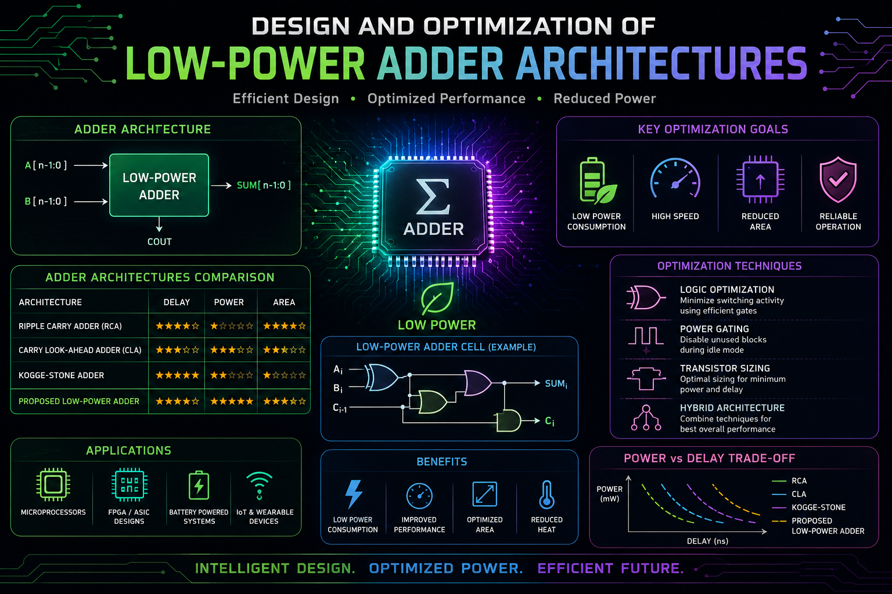

  

<h1 align="center"></h1>

Design-and-Optimization-of-Low-Power-Adder-Architectures

# Design-and-Optimization-of-Low-Power-Adder-Architectures
Design and optimization of low-power digital adder architectures to improve energy efficiency and performance in VLSI systems.

# Design and Optimization of Low-Power Adder Architectures

## Overview
This project focuses on the **design and optimization of low-power adder architectures** for energy-efficient digital systems. Adders are fundamental components used in arithmetic logic units (ALUs), multipliers, processors, and digital signal processing systems. Since arithmetic operations are performed frequently in digital circuits, the power consumption of adders significantly affects the overall efficiency of computing systems.

This work proposes a **multiplexer-based full adder architecture** designed to reduce power consumption while maintaining correct functionality and performance. The design is implemented and simulated using FPGA design tools to evaluate its efficiency.

---

## Problem Statement
Modern computing systems require **low-power digital circuits** to support energy-efficient computing, especially in portable and embedded devices. Traditional adder architectures often consume significant power due to high switching activity and complex gate structures.

The key challenge addressed in this project is **reducing the power consumption of adder circuits** while maintaining reliable arithmetic operations.

---

## Objective
The primary objective of this project is to design and evaluate a **multiplexer-based full adder architecture** that improves power efficiency.

### Goals
- Design a **low-power full adder using multiplexers**
- Reduce circuit complexity
- Evaluate functional correctness using simulation
- Compare performance with conventional adder architectures
- Demonstrate energy-efficient arithmetic computation

---

## Introduction
Adders are essential building blocks in digital electronics and are used extensively in:

- Arithmetic Logic Units (ALUs)
- Multipliers
- Digital Signal Processing systems
- Microprocessors
- Embedded computing systems

As digital systems become more complex, **power consumption has become a critical design constraint**. Traditional adder designs rely on combinations of XOR, AND, and OR gates, which can increase switching activity and power usage.

To address this issue, this project proposes a **multiplexer-based design approach**, where multiplexers are used to implement the core logic of a full adder.

---

## Proposed Design

### Multiplexer-Based Full Adder
The proposed architecture implements a **4:1 multiplexer-based full adder**. Multiplexers are used to compute both the **sum and carry outputs**.

#### Sum Generation
The **sum output** is generated by a multiplexer that selects between:

- \(A \oplus B\)
- Inverted value of \(A \oplus B\)

The selection is controlled by the **carry input (Cin)**.

#### Carry Generation
The **carry output** is generated using another multiplexer configured with inputs **A and B as control signals**.

### Advantages of the Design
- Reduced gate count
- Lower switching activity
- Improved power efficiency
- Simplified circuit structure
- Better scalability for larger arithmetic circuits

---

## Circuit Schematic
The schematic diagram represents the **hardware implementation of the multiplexer-based full adder**.

The schematic includes:

- Input signals: A, B, Cin
- Multiplexer blocks for sum generation
- Multiplexer blocks for carry generation
- Signal routing between components

This structure replaces traditional gate-based logic with **efficient multiplexer-based logic selection**.

---

## Ripple Carry Adder Implementation
To evaluate the proposed full adder architecture, multiple full adders are connected to form a **Ripple Carry Adder (RCA)**.

### Ripple Carry Adder Characteristics
- Sequential connection of full adders
- Carry output of one stage becomes carry input of the next stage
- Simple and widely used architecture
- Suitable for arithmetic operations in digital systems

Using the multiplexer-based full adder within the ripple carry structure can improve **power efficiency in larger arithmetic circuits**.

---

## Simulation and Implementation

The design was implemented and verified using **Xilinx Vivado**, a widely used FPGA development environment.

### Simulation Objectives
- Verify functional correctness
- Validate sum and carry outputs
- Test different input combinations
- Evaluate circuit behavior during arithmetic operations

Simulation results confirm that the **proposed architecture produces correct outputs and maintains stable operation**.

---

## Results
The simulation demonstrates that the proposed design:

- Correctly generates **sum and carry outputs**
- Reduces logic complexity
- Improves power efficiency compared to conventional designs

The results indicate that the architecture is suitable for **low-power digital arithmetic systems**.

---

## Conclusion
This project demonstrates that **multiplexer-based adder architectures can significantly reduce power consumption in digital circuits**.

The proposed design achieves:

- Lower power consumption
- Reduced hardware complexity
- Efficient arithmetic computation

These improvements make the architecture suitable for **energy-efficient digital systems, FPGA implementations, and embedded computing platforms**.

---

## Future Scope
Future work can extend this design in several directions:

- Implementation of larger adders (16-bit, 32-bit, and 64-bit)
- Integration into multipliers and ALU architectures
- Further optimization for delay and area
- ASIC implementation for ultra-low-power systems
- Exploration of advanced adder architectures

---

## Tools and Technologies
- Verilog / HDL
- Xilinx Vivado
- FPGA Design Flow
- Digital Logic Design Techniques

---

## Applications
Low-power adder architectures are widely used in:

- Arithmetic Logic Units (ALU)
- Digital Signal Processing systems
- Embedded processors
- FPGA-based computing systems
- Low-power VLSI circuits

---

## References
1. Priya, S. S. S., & Benita, B. (2018). A Design of Low Power Adders. IEEE International Conference on Devices, Circuits and Systems.
2. Srikanth, S., Banu, I. T., Priya, G. V., & Usha, G. (2016). Low Power Array Multiplier Using Modified Full Adder. IEEE International Conference on Engineering and Technology.
3. Mohanty, B. K., & Patel, S. K. (2014). Area–Delay–Power Efficient Carry-Select Adder. IEEE Transactions on Circuits and Systems II.
